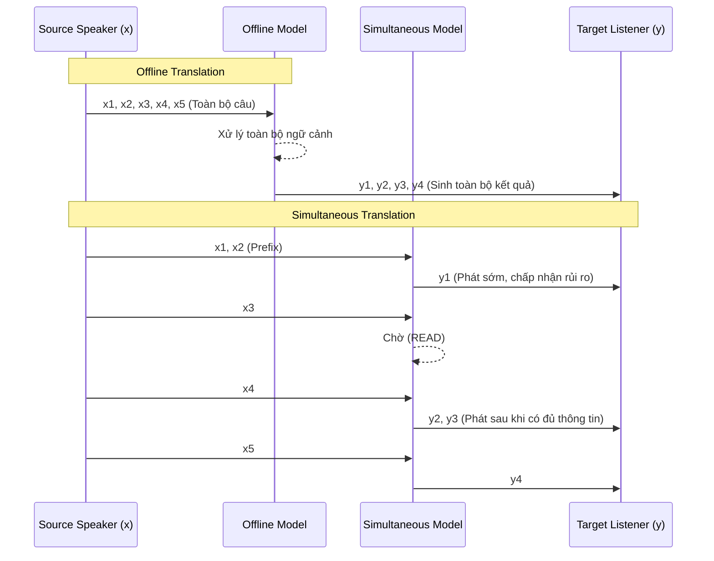

# Offline translation và simultaneous translation

Chào các bạn, để thực sự hiểu được sự phức tạp của dịch đồng thời (Simultaneous Translation), cách tốt nhất là chúng ta hãy bắt đầu bằng việc nhìn lại người anh em quen thuộc của nó: Dịch máy ngoại tuyến (Offline Machine Translation). Việc hiểu rõ ranh giới giữa hai thế giới này sẽ giúp chúng ta nhận ra tại sao những phương pháp vốn rất thành công trong offline lại thường vấp ngã khi đưa vào môi trường streaming.

## Sự Khác Biệt Cốt Lõi Về Điều Kiện Thông Tin

Trong dịch máy offline, mô hình được cung cấp một lợi thế tuyệt đối: **toàn tri về ngữ cảnh**. Hệ thống nhận trọn vẹn toàn bộ câu nguồn (source sentence) rồi mới bắt đầu quá trình sinh câu đích (target sentence).

Nếu chúng ta biểu diễn câu nguồn là một chuỗi $x = (x_1, x_2, \dots, x_n)$, khi mô hình dự đoán token đích $y_t$ tại bước $t$, nó có thể sử dụng thông tin từ *mọi* token của $x$, từ $x_1$ cho đến tận $x_n$. Bài toán ở đây là tính xác suất $P(y_t | y_{<t}, x)$.

Ngược lại, **Simultaneous translation thay đổi hoàn toàn điều kiện thông tin**.

Tại thời điểm hệ thống sinh ra token $y_t$, nó có thể chỉ mới quan sát được một phần tiền tố (prefix) của câu nguồn, ký hiệu là $x_{\le i}$. Các token từ $x_{i+1}$ đến $x_n$ có thể chưa được người dùng phát âm, hoặc dữ liệu âm thanh/văn bản chưa kịp truyền tới hệ thống.

Do đó, bài toán không còn đơn thuần là *"dịch câu này tốt nhất có thể"* mà biến thành một bài toán tối ưu đa mục tiêu: *"Vừa lắng nghe, vừa quyết định khi nào thì có đủ thông tin để nói"*. Xác suất lúc này trở thành $P(y_t | y_{<t}, x_{\le i})$.

## Cam Kết Sớm Tạo Ra Rủi Ro (Commitment Risk)

Trong giao diện streaming (ví dụ: phụ đề trực tiếp chạy trên màn hình, hoặc dịch giọng nói theo thời gian thực), một target token khi đã được phát ra thường được xem là một **sự cam kết (commitment)**.

Hãy tưởng tượng bạn đang dịch đuổi. Nếu sau khi bạn phát ra một từ, mà diễn biến tiếp theo của câu nguồn lại làm thay đổi hoàn toàn ý nghĩa của từ đó, hệ thống (và cả bạn) rơi vào một thế tiến thoái lưỡng nan:
1. **Sửa lại output (Revision):** Xóa từ cũ đi viết từ mới. Điều này làm màn hình giật cục, gây trải nghiệm vô cùng khó chịu (flickering).
2. **Phát thêm từ giải thích:** Làm câu văn lủng củng và người nghe bối rối.
3. **Chấp nhận lỗi:** Mặc kệ lỗi sai và cố gắng dịch tiếp, chấp nhận chất lượng bản dịch giảm sút nghiêm trọng.

Đây chính là **Commitment Risk**. Câu hỏi cốt lõi của bài toán điều khiển (control problem) ở đây là: *Hệ thống nên chờ bao lâu trước khi cam kết?*
- Chờ lâu (đọc nhiều source hơn) $\rightarrow$ Giảm rủi ro dịch sai, nhưng tăng độ trễ (Latency).
- Phát sớm (cam kết sớm) $\rightarrow$ Latency thấp, trải nghiệm "thời gian thực" tốt, nhưng rủi ro ảo giác (hallucination) hoặc sai lệch ý nghĩa tăng vọt.

## 3 Khó Khăn Kinh Điển Trong Dịch Đồng Thời

Để hiểu tại sao việc "phát sớm" lại nguy hiểm, chúng ta hãy mổ xẻ 3 nguyên nhân chính tạo nên rào cản cho dịch đồng thời.

### 1. Bằng chứng bị trì hoãn (Delayed Evidence)

Đây là hiện tượng một token đích $y_t$ cần phụ thuộc mật thiết vào một source token $x_j$ mà hiện tại chưa xuất hiện ($j > i$).

**Ví dụ:** Tiếng Đức nổi tiếng với việc đặt động từ ở cuối câu.
- Tiếng Đức (Source): `Ich habe den Apfel gegessen.` (Tôi *có* quả táo *đã ăn*)
- Tiếng Anh (Target): `I ate the apple.`
Khi dịch sang tiếng Anh, để phát ra từ `ate` (động từ), hệ thống phải chờ đến tận từ `gegessen` ở tít cuối câu tiếng Đức. Nếu hệ thống vội vã phát `I have...`, nó đã sập bẫy cấu trúc ngữ pháp. Thông tin quyết định (evidence) đã bị trì hoãn.

### 2. Sự sắp xếp lại trật tự từ (Reordering)

Ngôn ngữ nguồn và ngôn ngữ đích không phải lúc nào cũng ánh xạ tuyến tính 1-1.

Giả sử cấu trúc nguồn là: `Subject - Verb - Adjective - Object - Time`
Cấu trúc đích cần là: `Subject - Object - Adjective - Time - Verb` (Như cấu trúc SOV trong tiếng Nhật/Hàn).

Để sinh token thứ hai (`Object`), hệ thống phải "vươn" qua tận vị trí thứ tư của chuỗi nguồn. Trật tự thông tin bị đảo lộn (reordering) ép hệ thống hoặc phải "ngâm" độ trễ khá lâu, hoặc phải tự tin "đoán mò" (anticipation) danh từ tân ngữ trước khi nó thực sự được nói ra.

### 3. Nguy cơ Cam kết (Commitment Risk) đã phân tích ở trên

Khi bạn đã phát ra `I have` thay vì `I ate`, bạn đã tự đưa mình vào ngõ cụt. Việc không thể "Undo" trong thời gian thực buộc hệ thống phải sở hữu một khả năng đánh giá độ chắc chắn (confidence) cực kỳ đáng tin cậy.

## Tổng Kết

Dịch máy ngoại tuyến tối ưu hóa câu dịch sau khi mọi mảnh ghép đã nằm gọn trên bàn. Ngược lại, **Dịch đồng thời tối ưu hóa một quá trình ra quyết định dưới điều kiện thiếu thông tin tương lai**.

Nó vừa là một bài toán **Dự đoán (Prediction - Sinh token gì?)**, vừa là một bài toán **Điều khiển (Control - Khi nào sinh token đó?)**. Nếu chúng ta chỉ dùng BLEU score để đánh giá kết quả dịch cuối cùng, chúng ta đang bỏ lỡ một nửa bức tranh. Chúng ta cần công cụ để đo lường diễn biến của quá trình chờ đợi và ra quyết định này. Đó chính là lý do chúng ta cần đến các độ đo Latency, mà bài tiếp theo sẽ thảo luận chi tiết.
