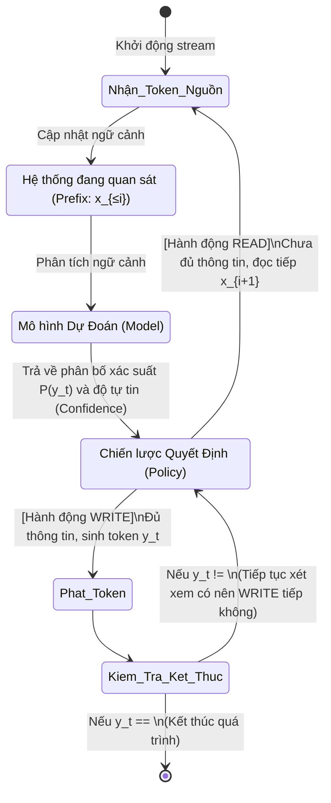

# Khung điều khiển READ và WRITE

Chào các bạn, ở bài trước chúng ta đã thống nhất rằng dịch đồng thời không chỉ là sinh ra văn bản, mà là một chuỗi các quyết định *khi nào nên chờ* và *khi nào nên nói*. Để mô hình hóa toán học cho quá trình này, giới nghiên cứu đã quy chuẩn nó thành một khung hành động (action framework) cực kỳ thanh lịch.

Mọi hệ thống dịch đồng thời, dù phức tạp đến đâu (từ mô hình sequence-to-sequence nhỏ gọn đến các LLM khổng lồ), đều có thể được tối giản hóa thành một vòng lặp liên tục của hai hành động: **`READ`** và **`WRITE`**.

## Định Nghĩa Hai Hành Động

1. **`READ` (Đọc/Chờ):**
   - Hệ thống quyết định "Tôi chưa có đủ thông tin". Nó giữ im lặng, không sinh thêm bất kỳ token đích (target token) nào, và hấp thụ thêm một token nguồn (source token) tiếp theo từ luồng dữ liệu (stream).
   - *Tác động:* Tăng số lượng token nguồn đã quan sát $i \rightarrow i + 1$. Trạng thái bộ nhớ mô hình (ví dụ: Encoder hidden states, KV cache) được cập nhật.

2. **`WRITE` (Viết/Phát):**
   - Hệ thống quyết định "Tôi đã đủ tự tin với lượng thông tin hiện tại". Nó "chốt" và phát ra một token đích $y_t$.
   - *Tác động:* Tăng số lượng token đích đã sinh ra $t \rightarrow t + 1$. Token này được hiển thị cho người dùng và không thể bị thu hồi (theo định lý Commitment Risk).

### Trạng Thái Của Hệ Thống
Tại bất kỳ thời điểm nào, trạng thái (state) của hệ thống được định nghĩa hoàn toàn bởi hai con số:
- $i$: Số lượng source token đã đọc.
- $t$: Số lượng target token đã sinh.

Mỗi khi chọn hành động, hệ thống đang làm thay đổi trạng thái này. Quá trình kết thúc khi hệ thống đọc hết câu nguồn (EOF - End of File/Stream) và sinh ra token kết thúc câu đích (`<EOS>` - End of Sentence).

## Mô Hình Trạng Thái (State Machine)

Hãy cùng nhìn vào sơ đồ luồng (State Machine) dưới đây để hình dung trực quan cách một *Policy* (Chiến lược) điều khiển hệ thống chuyển đổi giữa hai trạng thái `READ` và `WRITE`.

**Một điểm tinh tế cần lưu ý:**
Khi hệ thống thực hiện lệnh `WRITE` và phát ra $y_t$, nó không nhất thiết phải quay lại lệnh `READ` ngay lập tức. Nếu $Policy$ đánh giá rằng lượng thông tin hiện tại ($x_{\le i}$) là "quá dư dả", hệ thống có thể thực hiện một chuỗi các lệnh `WRITE` liên tiếp ($y_t, y_{t+1}, y_{t+2}, \dots$) trước khi cần phải `READ` lại.

## Sự Tách Biệt Giữa Model và Policy

Khung `READ/WRITE` làm nổi bật một nguyên lý thiết kế cốt lõi trong dịch đồng thời: Sự tách biệt giữa **Model** (Mô hình) và **Policy** (Chiến lược).

*   **Lớp Model (Mô hình Dịch - Năng lực Ngôn ngữ):**
    Nhiệm vụ của mô hình là trả lời câu hỏi *"Dựa trên những gì tôi đã thấy ($x_{\le i}$) và những gì tôi đã nói ($y_{<t}$), token tiếp theo **nên là gì**?"*
    Nó là một cỗ máy tính toán xác suất đơn thuần. Nó tính toán $P(y_t | x_{\le i}, y_{<t})$.

*   **Lớp Policy (Chiến lược Điều khiển - Năng lực Ra Quyết Định):**
    Nhiệm vụ của Policy là nhận thông tin từ Model (như xác suất, attention weights) và bối cảnh (như $i, t$), để trả lời câu hỏi *"Có **nên phát** cái token mà mô hình vừa gợi ý ra không, hay phải **chờ** thêm?"*

Bạn hoàn toàn có thể lấy một mô hình LLM siêu mạnh (như GPT-4) và áp dụng một Policy cực kỳ tồi tệ (ví dụ: cứ dịch bừa ngay từ token đầu tiên), kết quả sẽ là một thảm họa. Ngược lại, một mô hình nhỏ nhưng có một Policy thông minh (như biết ngập ngừng chờ đợi đúng lúc trật tự từ bị đảo) sẽ cho ra trải nghiệm mượt mà hơn nhiều.

## Ví Dụ Cụ Thể Về Chuỗi Hành Động

Giả sử ta dịch câu `Tôi yêu bạn` sang tiếng Anh là `I love you`.
Chuỗi hành động có thể diễn ra như sau:

1. `READ` ("Tôi") $\rightarrow i=1$
2. `WRITE` ("I") $\rightarrow t=1$
3. `READ` ("yêu") $\rightarrow i=2$
4. `WRITE` ("love") $\rightarrow t=2$
5. `READ` ("bạn") $\rightarrow i=3$
6. `WRITE` ("you") $\rightarrow t=3$

Hoặc một Policy cẩn thận hơn (đợi nghe hết "Tôi yêu" mới dám dịch "I"):
1. `READ` ("Tôi") $\rightarrow i=1$
2. `READ` ("yêu") $\rightarrow i=2$
3. `WRITE` ("I") $\rightarrow t=1$
4. `WRITE` ("love") $\rightarrow t=2$
5. `READ` ("bạn") $\rightarrow i=3$
6. `WRITE` ("you") $\rightarrow t=3$

## Tóm Lại

Mọi phương pháp nghiên cứu mà chúng ta sẽ tìm hiểu trong các bài tiếp theo (như Wait-k, Local Agreement, v.v.) thực chất chỉ là những cách thức (heuristic hoặc học máy) khác nhau để **thiết kế cái hàm Policy này**. Mục tiêu chung là tìm ra điểm cân bằng tối ưu: Gọi `WRITE` càng sớm càng tốt để giảm độ trễ, nhưng phải gọi `READ` đúng lúc để đảm bảo tính chính xác của bản dịch.

Trong bài tới, chúng ta sẽ học cách "lưu dấu vết" lại các chuỗi hành động này để đo lường chúng một cách định lượng bằng Latency Trace $g(t)$.
