# Latency trace g(t): Dấu Vết Độ Trễ

Chào các bạn! Trong bài trước, chúng ta đã biến hệ thống dịch đồng thời thành một cỗ máy chỉ biết làm hai việc: `READ` (chờ/đọc thêm) và `WRITE` (phát ra token). Nhưng để thực sự nghiên cứu và so sánh các cỗ máy này, chúng ta không thể chỉ ngồi nhìn chúng chạy. Chúng ta cần một cách để ghi chép lại toàn bộ "lịch sử hành động" của chúng.

Đó là lúc khái niệm **Latency Trace (Dấu vết độ trễ)**, ký hiệu là $g(t)$, ra đời. Đây là công cụ nền tảng nhất, viên gạch đầu tiên để xây dựng mọi hệ thống đánh giá (evaluation metrics) trong dịch đồng thời.

## Định Nghĩa Toán Học Của $g(t)$

Một cách đơn giản: **$g(t)$ là số lượng token nguồn (source tokens) mà hệ thống đã đọc tính đến thời điểm nó quyết định phát ra token đích thứ $t$ (target token $y_t$).**

Hãy tưởng tượng bạn có:
- Một câu nguồn (source) có chiều dài $|x| = n$ token.
- Một câu đích (target) sinh ra có chiều dài $|y| = m$ token.

Trace $g(t)$ sẽ là một dãy gồm $m$ con số: $[g(1), g(2), g(3), \dots, g(m)]$.

**Hai tính chất bắt buộc của $g(t)$:**
1. **Không giảm (Non-decreasing):** $g(t) \le g(t+1)$. Điều này hiển nhiên vì thời gian không thể quay ngược; bạn không thể "chưa đọc" (unread) một token nguồn mà bạn đã tiếp nhận.
2. **Bị chặn:** $0 < g(t) \le n$. Bạn luôn phải đọc ít nhất 1 token nguồn (thường thì thế) trước khi phát token đích đầu tiên, và bạn không thể đọc nhiều hơn tổng số lượng token của câu nguồn.

## Đọc Hiểu Một Trace Bằng Biểu Đồ

Giả sử ta dịch một câu nguồn có $n=5$ token, sinh ra câu đích có $m=4$ token. Hệ thống ghi nhận được trace sau:
`g = [2, 4, 5, 5]`

Ta hãy dịch chuỗi số khô khan này ra ngôn ngữ đời thường:
- $g(1) = 2$: Để nói ra từ đầu tiên ($y_1$), hệ thống đã phải nín thở chờ nghe xong 2 từ bên nguồn ($x_1, x_2$).
- $g(2) = 4$: Từ thứ hai ($y_2$) chỉ được thốt ra khi hệ thống nghe được 4 từ ($x_1 \dots x_4$).
- $g(3) = 5$: Từ thứ ba ($y_3$) được phát ra khi hệ thống đã nghe trọn vẹn toàn bộ câu nguồn ($n=5$).
- $g(4) = 5$: Từ thứ tư (và cũng là từ cuối cùng) được phát ra ngay lập tức sau $y_3$, mà không cần chờ thêm nguồn (vì nguồn đã cạn).

Dưới đây là sơ đồ Mermaid mô phỏng cách hệ thống thực hiện chuỗi READ/WRITE để tạo ra vết (trace) này:

```mermaid
gantt
    title Minh họa Trace g = [2, 4, 5, 5]
    dateFormat  X
    axisFormat %s

    section Nguồn (Source)
    x1 (READ)     :a1, 0, 1
    x2 (READ)     :a2, 1, 2
    x3 (READ)     :a3, 2, 3
    x4 (READ)     :a4, 3, 4
    x5 (READ)     :a5, 4, 5

    section Đích (Target)
    y1 (WRITE - g(1)=2) :done, b1, 2, 3
    y2 (WRITE - g(2)=4) :done, b2, 4, 5
    y3 (WRITE - g(3)=5) :done, b3, 5, 6
    y4 (WRITE - g(4)=5) :done, b4, 6, 7
```



*Trong sơ đồ trên, thanh ngang của `y1` bắt đầu ngay sau khi thời điểm `x2` kết thúc, tương ứng với $g(1)=2$.*

## Tại Sao Trace $g(t)$ Lại Vô Cùng Quan Trọng?

Nhiều người lầm tưởng rằng chỉ cần điểm chất lượng dịch (BLEU, COMET) là đủ. Nhưng trong thế giới streaming, **Trace kể một câu chuyện mà kết quả cuối cùng không bao giờ nói ra được.**

Hãy tưởng tượng hai hệ thống A và B cùng dịch ra một câu giống hệt nhau (chất lượng 100% giống nhau):

- **Hệ thống A (Trace [1, 2, 3, 4, 5]):** Cứ nghe một từ nguồn là dịch ngay ra một từ đích. Nhịp độ rải đều đặn, độ trễ rất thấp, người nghe cảm thấy thông tin tuôn trào liên tục.
- **Hệ thống B (Trace [5, 5, 5, 5, 5]):** Nín lặng từ đầu đến cuối. Đợi diễn giả nói xong toàn bộ câu (đọc hết 5 token nguồn) rồi mới "bắn" ra một loạt 5 token đích.

Nếu chỉ nhìn văn bản dịch, A và B y hệt nhau. Nhưng nếu mang ra thực tế (ví dụ hội nghị trực tuyến), Hệ thống B là một hệ thống **offline trá hình**. Trải nghiệm người dùng của Hệ thống B cực kỳ tệ (thời gian chết quá lâu), trong khi Hệ thống A là một trải nghiệm "đồng thời" thực thụ.

$g(t)$ chính là "ống nghe y tế" để chúng ta bắt mạch hệ thống: có đang bị "nghẽn" (chờ quá lâu ở một từ), có "hấp tấp" (chưa nghe gì đã đoán), hay có đang hoạt động mượt mà không?

## Quan hệ giữa Trace và Policy

Mọi Policy (Chiến lược ra quyết định) đều sẽ in dấu ấn đặc trưng của nó lên Trace $g(t)$:
- **Policy Wait-k:** Thường tạo ra một trace dạng bậc thang tăng đều (rất dễ đoán).
- **Policy Fixed Chunk:** Tạo ra trace nhảy vọt theo từng block một.
- **Adaptive Policy (như Local Agreement / Confidence):** Sẽ có trace hình dạng "răng cưa" không đều. Nó có thể chờ rất lâu ($g(t)$ đứng im, $i$ tăng) ở những đoạn ngữ pháp phức tạp bị đảo lộn (Reordering), nhưng lại bắn token liên tục ($g(t)$ tăng nhanh) ở những đoạn dịch word-by-word đơn giản.

## Trace Trong Mã Nguồn Của Khóa Học

Trong repository này, khi các bạn chạy các file thí nghiệm (labs), hãy chú ý đến cấu trúc dữ liệu `SimultaneousResult`. Bên trong nó có một trường mang tên `read_positions`.

Trường `read_positions` này thực chất chính là mảng $g(t)$ mà chúng ta vừa học. Khi script hoàn tất quá trình dịch, nó sẽ in ra một dòng tương tự như:
```python
read_positions = [2, 4, 5, 5]
```

Đừng bỏ qua dòng dữ liệu này. Nó chính là nguyên liệu thô (raw data) duy nhất để chúng ta tính toán ra các thước đo độ trễ chuẩn mực (Average Proportion, Average Lagging) – chủ đề hấp dẫn mà chúng ta sẽ khám phá ngay trong bài tiếp theo!
