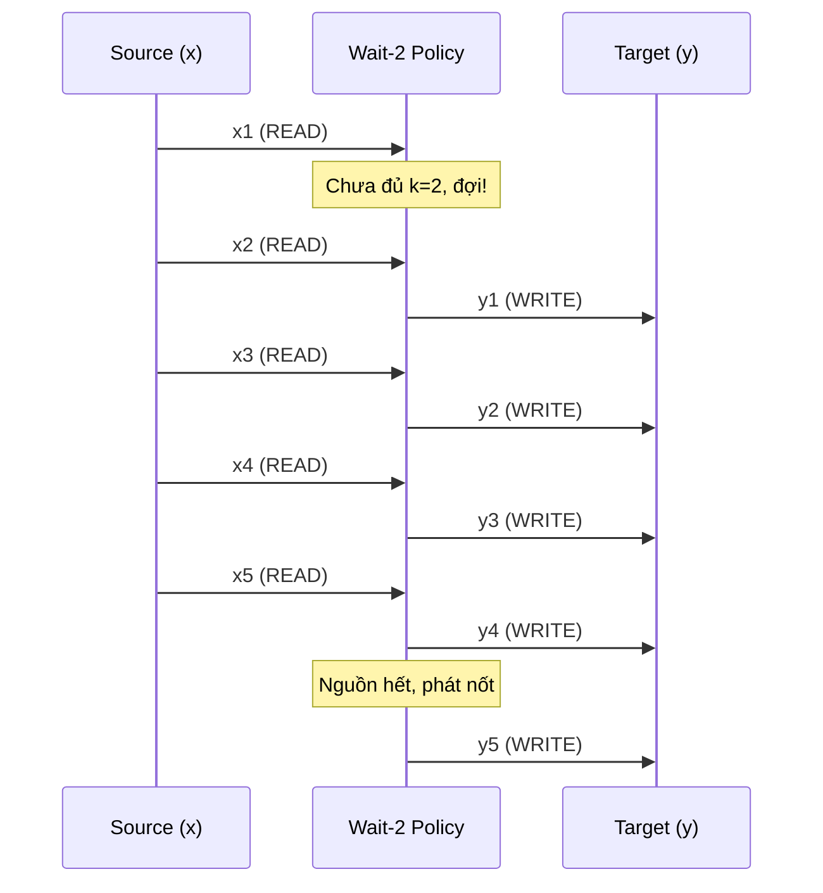
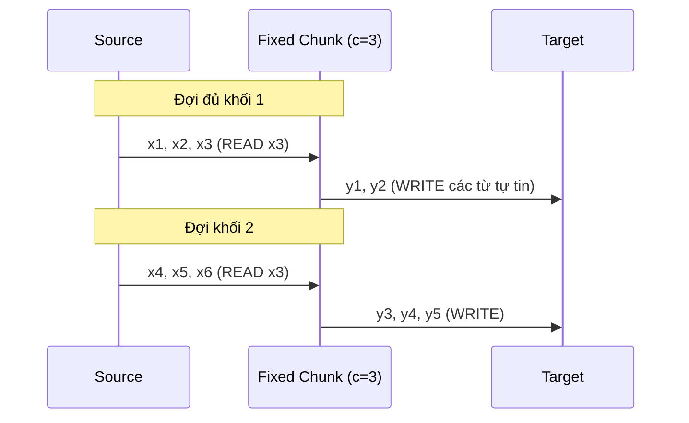

# Chiến lược tĩnh (Static Policies): Wait-k và Fixed Chunk

Chào mừng các bạn bước vào thế giới của các Chiến lược (Policies) trong dịch đồng thời! Như đã thảo luận ở các bài trước, Policy là "bộ não" điều khiển khi nào hệ thống gọi lệnh `READ` (chờ thông tin) và khi nào gọi lệnh `WRITE` (phát token dịch).

Để bắt đầu, chúng ta sẽ làm quen với hai chiến lược mang tính chất "kỷ luật sắt": **Wait-k** và **Fixed Chunk**. Chúng được gọi là các *chiến lược tĩnh (static policies)* vì luật lệ của chúng được cố định ngay từ đầu, không hề quan tâm đến nội dung ngữ nghĩa hay độ khó của câu nói đang diễn ra.

Mặc dù có vẻ cứng nhắc, nhưng sự đơn giản lại chính là sức mạnh giúp chúng trở thành nền tảng vô giá cho toàn bộ lĩnh vực này.

---

## 1. Chiến lược Wait-k: Khởi đầu kinh điển

### Ý Tưởng Cốt Lõi
Được giới thiệu bởi Ma et al. (2019) trong paper mang tính bước ngoặt *"STACL: Simultaneous Translation với Implicit Anticipation và Controllable Latency"*, Wait-k có một quy tắc duy nhất, vô cùng thanh lịch:

**"Tôi sẽ nín lặng đợi nghe đúng $k$ từ nguồn đầu tiên, sau đó tôi sẽ dịch đuổi nhịp 1-1 với bạn: bạn nói một từ, tôi dịch một từ."**

Giá trị $k$ chính là tham số điều khiển độ trễ.
- Nếu $k=1$, hệ thống dịch gần như tức thời (tương đương với dịch word-by-word). Độ trễ cực thấp nhưng rủi ro sai sót cực cao.
- Nếu $k=100$, hệ thống gần như biến thành offline translation (vì hiếm có câu nào dài quá 100 từ).
- Thông thường, các nghiên cứu chọn $k$ từ $3$ đến $9$ tùy cặp ngôn ngữ.

### Cơ Chế Hoạt Động (Mã giả)
Quy tắc hành động cho token đích thứ $t$:
$$ g(t) = \min(t + k - 1, |x|) $$

Nghĩa là: Để phát ra $y_t$, hệ thống phải đảm bảo rằng nó đã đọc được ít nhất $t + k - 1$ token nguồn (nhưng không vượt quá tổng độ dài câu nguồn $|x|$).

### Minh họa bằng Mermaid (Wait-k với $k=2$)
Giả sử có câu nguồn 5 từ, đích 5 từ. Với $k=2$, hệ thống chờ nghe 2 từ đầu ($x_1, x_2$), dịch từ đầu tiên ($y_1$), sau đó nghe 1 dịch 1.

Dấu vết $g(t)$ sinh ra sẽ là một đường thẳng chéo tịnh tiến: `[2, 3, 4, 5, 5]`.

### Ưu Điểm và Nhược Điểm của Wait-k
**Ưu điểm:**
- Cực kỳ dễ cài đặt.
- Độ trễ (Average Lagging) hoàn toàn nằm trong tầm kiểm soát (thường $AL \approx k$).
- Có thể dùng làm phương pháp ép mô hình (force teaching) trong quá trình huấn luyện (train model để quen với việc thiếu ngữ cảnh dài $k$).

**Nhược điểm:**
- Quá cứng nhắc. Khi dịch từ tiếng Anh sang tiếng Nhật (ngôn ngữ SOV có động từ ở cuối), $k=3$ có thể là không đủ để đợi cụm động từ, dẫn đến model bị ép phải "đoán bừa" (hallucinate) một cách hoảng loạn.

---

## 2. Chiến lược Fixed Chunk: Chờ đợi theo từng khối

### Ý Tưởng Cốt Lõi
Thay vì dịch trượt đuổi theo từng token nhỏ lẻ (có thể gây giật cục cho người đọc phụ đề), **Fixed Chunk** áp dụng tư duy "gom hàng sỉ". Hệ thống sẽ chờ (READ) một khối lượng từ cố định, dịch nguyên một cụm, rồi lại chờ tiếp một khối khác.

Tham số của nó là $c$ (chunk size - kích thước khối dữ liệu).

**Quy tắc:**
"Tôi sẽ chờ nghe $c$ từ, dịch toàn bộ những gì tôi hiểu, sau đó đợi tiếp $c$ từ nữa."

### Cơ Chế Hoạt Động
Trong thực tế, "dịch toàn bộ những gì tôi hiểu" được cài đặt bằng cách: hệ thống tiếp tục sinh `WRITE` cho đến khi mô hình dịch (Model) dự đoán rằng nó cần thêm thông tin. Điều này đòi hỏi Model phải có một tín hiệu hoặc tự đánh giá được độ tự tin, nhưng ở dạng đơn giản nhất, Fixed Chunk chỉ ép READ theo từng khối lớn.

### Minh họa bằng Mermaid (Chunk size $c=3$)

Dấu vết $g(t)$ sẽ có dạng bậc thang giật cục: `[3, 3, 6, 6, 6, 9, ...]`.

### Ưu Điểm và Nhược Điểm
**Ưu điểm:**
- Rất phù hợp với các mô hình nhận dạng giọng nói (ASR - Automatic Speech Recognition) vì xử lý âm thanh theo từng frame/chunk cố định (ví dụ mỗi khối 500ms).
- Giảm thiểu hiện tượng "màn hình nhấp nháy" liên tục nếu ứng dụng là phụ đề trực tiếp.

**Nhược điểm:**
- Độ trễ ở cuối mỗi chunk thường khá lớn và không mang lại hiệu quả thông tin mượt mà bằng Wait-k.
- Vẫn mắc chung nhược điểm của các chiến lược tĩnh: Mù quáng. Nó cắt đứt câu nói mà không quan tâm ranh giới cụm từ hay ngữ pháp. Cắt ngang một danh từ ghép có thể gây thảm họa.

---

## Tổng kết

Các chiến lược tĩnh như Wait-k và Fixed Chunk giống như việc bạn lái xe bằng cách hẹn giờ đạp phanh/ga bất chấp điều kiện đường xá. Nó dễ học, dễ lập trình, nhưng thiếu đi sự "thông minh" tinh tế.

Để giải quyết sự mù quáng này, các nhà nghiên cứu đã đặt câu hỏi: *"Liệu Policy có thể tự động co giãn độ trễ $g(t)$ dựa vào nội dung câu nói? Tức là chỗ nào dễ thì dịch nhanh, chỗ nào ngữ pháp lắt léo thì chủ động dừng lại chờ thêm không?"*

Câu trả lời sẽ có ở bài tiếp theo: **Chiến lược Thích ứng (Adaptive Policies)**!
